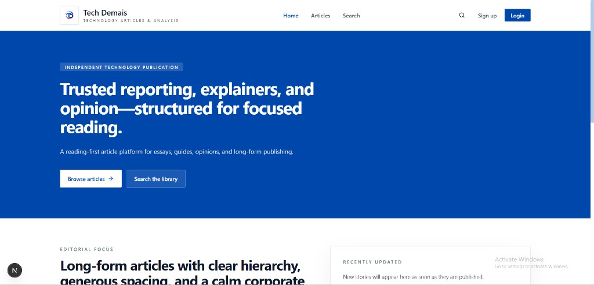
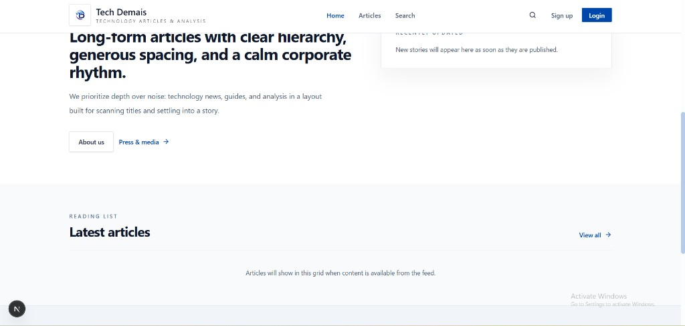
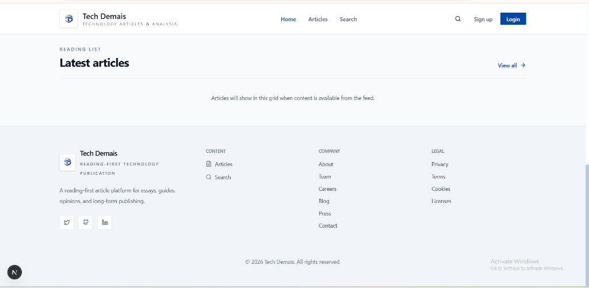
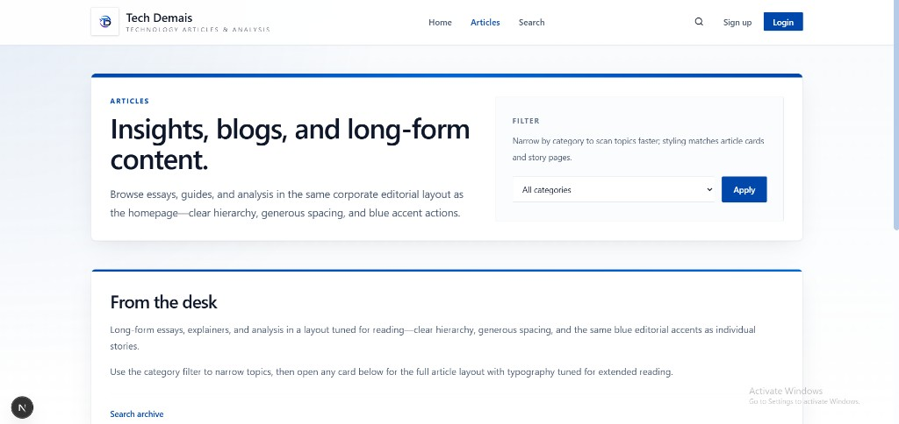
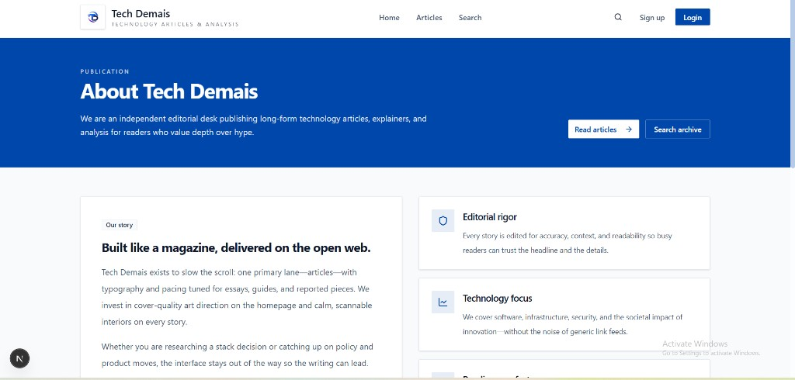
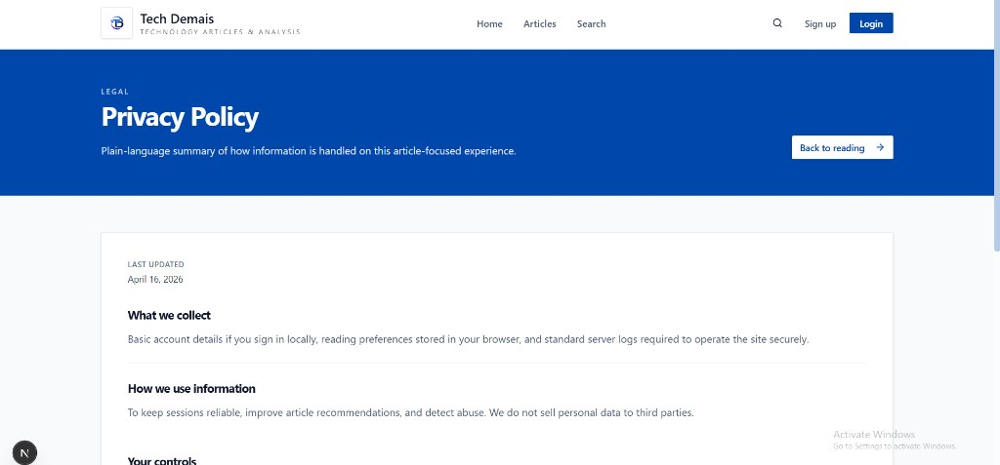

# Tech Demais

Next.js editorial site: article-first layout, corporate blue / slate palette, and reading-focused typography. The images below are committed so they render on GitHub.

## UI screenshots

### Home — hero



### Home — editorial focus and sidebar



### Home — reading list and footer



### Articles index



### About



### Privacy policy



## Development

```bash
pnpm install
pnpm dev
```

For deployment notes, see [deploy/README.md](./deploy/README.md).
